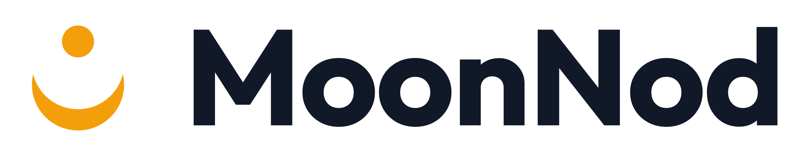

  <picture>
    <source media="(prefers-color-scheme: dark)" srcset="assets/moonnod-logo-on-dark.svg">
    
  </picture>

# MoonNod

Team startup project for **DATA/MSML 641: Natural Language Processing**, University of Maryland, Fall 2026.

**Status:** team forming (Session 3, September 15, 2026). Product and value proposition to be agreed.

## How we work

- Every task is an issue with a label, an assignee and a milestone, tracked on the project board.
- One branch per issue. A teammate reviews and approves every pull request; `main` is protected.
- Commits and pull requests link the issue they close.
- Weekly reports go in `reports/sessionNN.md` (two digits) on `main` by 5:00 p.m. Eastern each Tuesday. Copy `reports/_TEMPLATE.md`.
- User evidence (recordings, usage logs, task tests) is committed in the same week as the claim, with anything personal removed.

## The name

In Tamil, மதி (*mathi*) means both **moon** and **understanding**, and a nod means "I understand you." The mark is the chandrabindu (ँ), a sign used across Indian scripts whose Sanskrit name means "moon dot."
